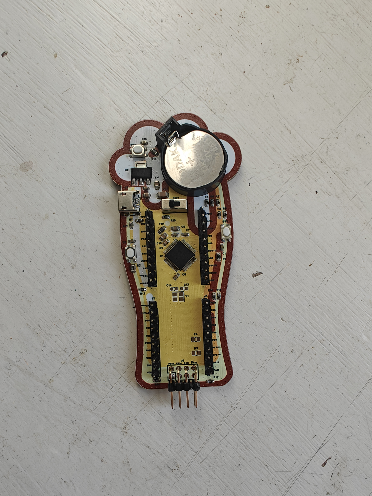
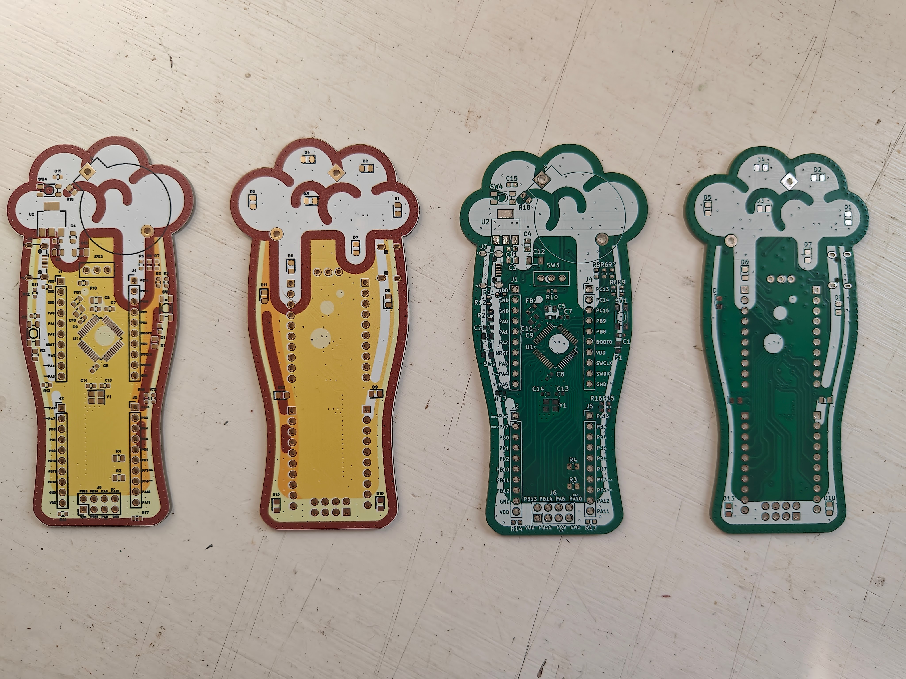
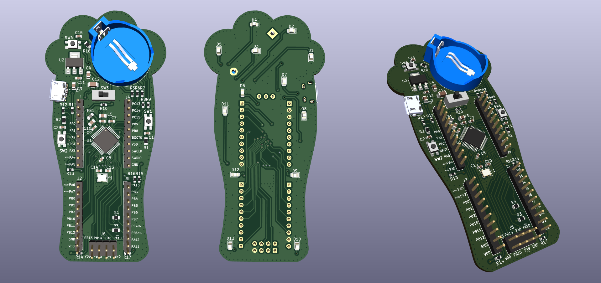

# BeerBoard

**BeerBoard** is a beer-shaped microcontroller breakout board based on the STM32F030C6T6. [Schematic can be found here.](https://github.com/potpurri/BeerBoard/blob/a81b2d54139fa46588d7e338071e49ddc263d606/Schematic_v02.pdf) Originally designed as a trophy for a beer quiz, its primary feature is blinking LEDs, adding a fun, interactive element to the prize. The project also served as an opportunity to experiment with JLCPCB's multicolor silkscreen options.

This board consists of **4 layers**, providing a robust platform for various applications beyond its original purpose. It also includes **breakout pins for I2C, SPI, and USART**, offering versatile connectivity options for external devices and peripherals. Below are images showing the assebled board, different silkscreen options and 3D renderings of the BeerBoard.

## Features
- Beer-shaped PCB design
- STM32F030C6T6 microcontroller at its core
- Blinking LEDs for visual effects
- 4-layer PCB
- Available in both multicolor and regular silkscreen versions

## Images

### Assembled board

### PCBs

### 3D Renderings & Schematic

